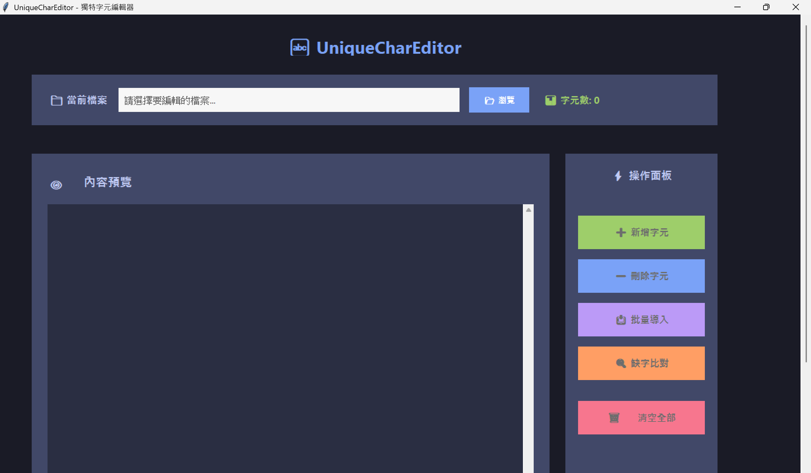

# UniqueCharEditor


## 🚀 下載與快速安裝

- [👉 前往 Releases 下載最新版本](https://github.com/XiaoPuOuO/UniqueCharEditor/releases)
- **Windows 用戶**可直接下載 `UniqueCharEditor.exe` 執行檔（免安裝）
- 需原始碼或其他平台請下載 `UniqueCharEditor-src.zip`

---

一個基於 Python tkinter 製作的輕量級唯一字元檔案編輯器。  
適合用於字型設計、遊戲字庫、缺字比對等場合，支援批量導入、比對與高亮查找。



---

## 特色功能

- **唯一字元管理**：自動去除重複字元，確保檔案中每個字元唯一。
- **字體與字級預覽**：可自訂字體、字級，便於快速瀏覽。
- **字元查找與高亮**：輸入字元一鍵高亮所有出現位置。
- **批量新增／刪除字元**：可同時新增或刪除多個字元。
- **批量導入字元檔案**：自動去重，合併新字元。
- **缺字比對**：與其他 txt 檔案比對，列出缺漏字元。
- **內容清空**：快速重設所有字元內容。
- **圖形化操作介面**：直覺易用，無需命令列。

---

## 適用場景

- 字型設計、補字、字表管理
- 遊戲專案自訂字庫（如 RPG Maker、獨立遊戲美術字）
- 缺字、異體字查找、批次補字
- 其它單字管理、比對用途

---

## 安裝與執行

### 環境需求

- Python 3.7 以上（含標準 tkinter，Windows/macOS/Linux 均可）

### 操作步驟

1. **下載專案**
    ```bash
    git clone https://github.com/XiaoPuOuO/UniqueCharEditor.git
    cd UniqueCharEditor
    ```

2. **啟動工具**
    ```bash
    python -m unique_char_editor.editor
    ```
    或
    ```bash
    python unique_char_editor/editor.py
    ```

3. **基本操作**
    - 點「選擇檔案」載入欲管理的 txt 檔案（請自行備份！）
    - 可透過介面執行新增、刪除、批量導入、比對缺字等功能
    - 支援即時預覽、字體/字級調整與高亮查找

---

## 開源授權

本專案採用 [MIT License](./LICENSE) 授權，歡迎自由使用、修改與再發布。

---

## 聯絡回饋

歡迎提交 issue 或 pull request 指教與建議。

---

> **持續精進，把想法做成專業作品。**